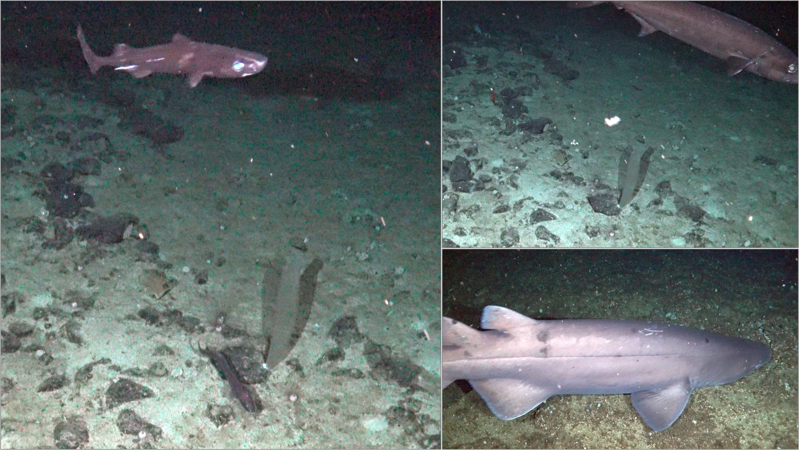
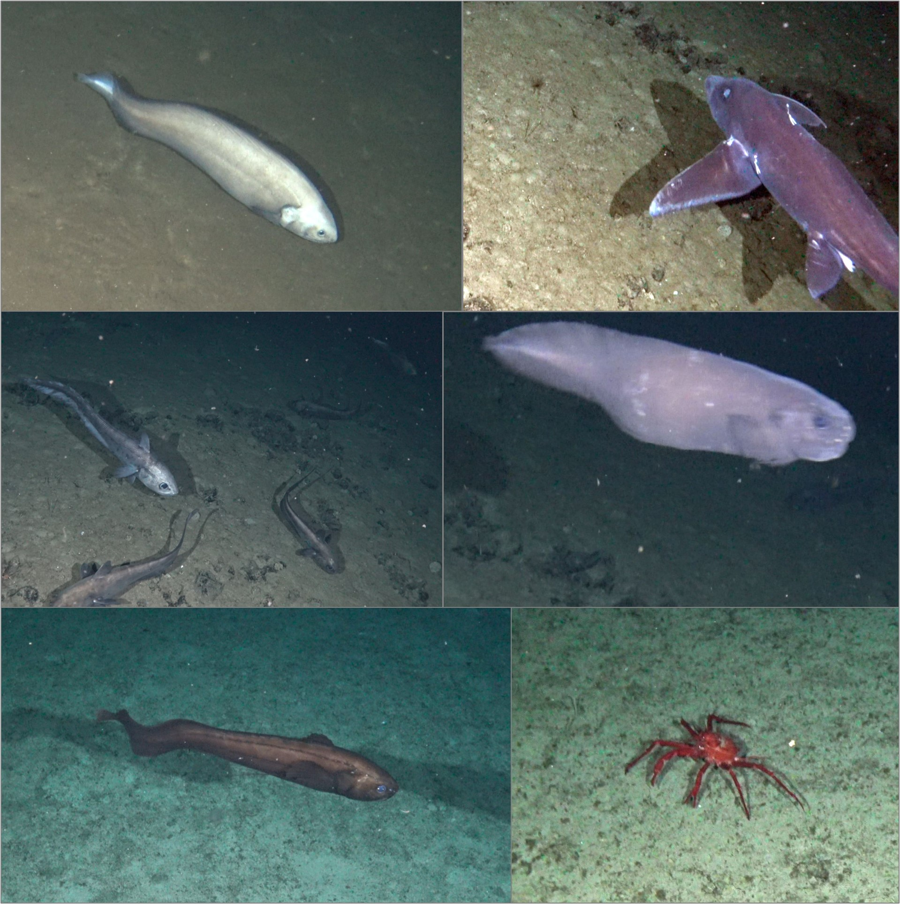
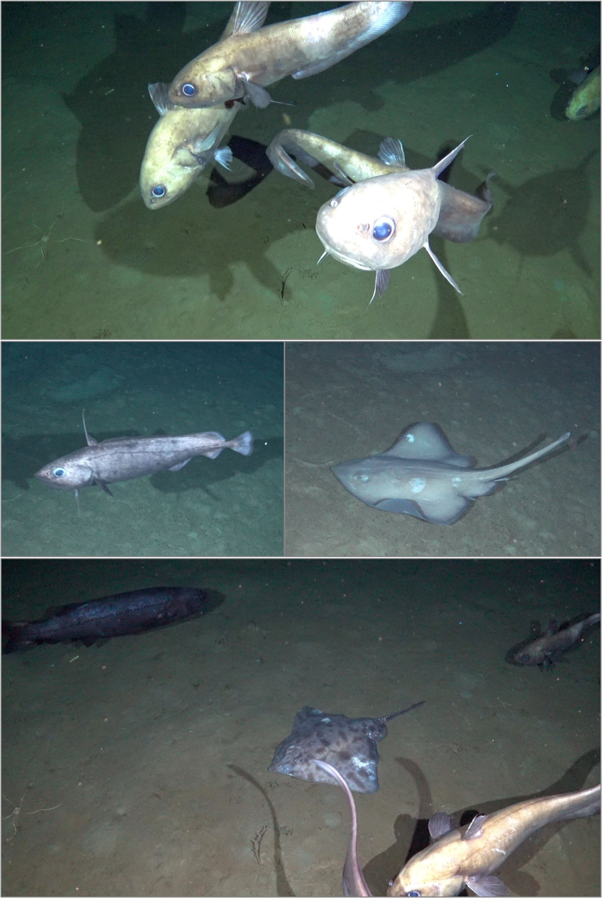

# Introducción

El gobierno de Colombia se ha comprometido a desempeñar un papel de liderazgo en la lucha contra la crisis global de pérdida de biodiversidad y el cambio climático. Un componente crítico de la visión y estrategia de la nación es proteger el 30% del territorio marino colombiano. Alcanzar esta meta ayudaría a salvaguardar la riqueza de la biodiversidad marina de Colombia, a producir beneficios a largo plazo para el país, y a mantener un océano saludable para el bienestar y disfrute de todos los colombianos. Para promover esta misión, National Geographic Pristine Seas está llevando a cabo una expedición sin precedentes para explorar, estudiar y documentar tres de las regiones mejor conservadas del Pacífico y el Caribe Colombiano: 1) dorsales de Yuruparí, Malpelo, y las Colinas y Lomas del Pacífico, 2) Golfo de Tribugá - Cabo Corrientes, y 3) arrecifes remotos al norte de Seaflower en el Caribe. La expedición se lleva a cabo desde el 1 de marzo al 21 de abril de 2022.

Este reporte presenta los resultados de la primera fase de la expedición, llevada a cabo del 1 al 16 de marzo de 2022, con el fin de informar el proceso de declaratoria de áreas marinas protegidas en el Pacífico colombiano.

# Antecedentes

La convergencia de las placas de Nazca y Cocos y la zona de fractura de Panamá hacen de la región central del océano Pacífico de Colombia un centro activo de expansión del fondo marino y de elevada actividad tectónica (Marcaillou et al., 2006). Estos procesos han dado lugar al surgimiento de las dorsales de Malpelo y de Yuruparí, eslabones clave de un sistema geomorfológico complejo que hace que esta región oceánica sea una de las más importantes del Pacífico Oriental Tropical (POT) debido a su alta productividad y diversidad biológica (Parques Nacionales Naturales de Colombia, 2017).
La oceanografía de la región está determinada por la Zona de Convergencia Intertropical (ZCI); una banda de baja presión atmosférica donde convergen los vientos alisios de ambos hemisferios. Cuando la ZCI se encuentra en su posición más septentrional (segundo semestre del año) los vientos alisios del sureste son dominantes y producen corrientes superficiales ciclónicas (en sentido antihorario). En la primera mitad del año, los vientos alisios del noreste revierten los patrones de circulación de las aguas superficiales y permiten el afloramiento de aguas frías ricas en nutrientes lo cual aumenta la productividad (Devis Morales et al., 2008). A una profundidad aproximada de 100 m, la región está influenciada durante todo el año por el Chorro de Tsuchiya del norte, que genera corrientes subsuperficiales hacia el este (Parques Nacionales Naturales de Colombia, 2017). Además de estos patrones oceanográficos, la compleja geomorfología de la región conduce a la creación de eventos locales como frentes térmicos y eddies que contribuyen a incrementar la productividad biológica mediante retención de partículas o afloramiento de aguas frías y ricas en nutrientes (Parques Nacionales Naturales de Colombia, 2017).
Las dorsales oceánicas de Malpelo y Yuruparí juegan un papel muy importante en la conectividad ecológica del Corredor Marino del Pacifico Este Tropical (CMAR). Especies de suma importancia – tanto ecológica como económica – incluyendo atunes, tiburones, tortugas marinas y cetáceos, habitan y migran entre las aguas de la región que incluye las islas Galápagos (Ecuador), Cocos (Costa Rica), Coiba (Panamá) y Malpelo (Colombia).
La cordillera de Malpelo se extiende por 300 km en dirección noreste-suroeste paralela a la cordillera de Cocos (Marcaillou et al., 2006). Tiene aproximadamente 100 km de ancho y aunque se eleva rápidamente desde más de 4.000 m bajo el nivel del mar, sus límites han sido definidos por la isóbata de 2.000 m (Marcaillou et al., 2006). La isla de Malpelo y los islotes circundantes representan la única porción emergida de esta cordillera que se originó a partir de actividad volcánica hace unos 20 millones de años (Sallarès et al., 2003). Debido a sus singularidades, la dorsal de Malpelo es considerada como una Área Marina de Importancia Ecológica o Biológica (EBSA) por parte de la Convención de Diversidad Biológica (CBD) de las Naciones Unidas (Secretariat of the Convention on Biological Diversity, 2020) y un sitio de Patrimonio natural de la Humanidad UNESCO.

La dorsal Yuruparí parece haberse separado de la dorsal Malpelo hace unos 8 millones de años (Lonsdale & Klitgord, 1978). Sigue una orientación este-oeste que se extiende a ambos lados de la frontera política entre Panamá y Colombia, y su punto más superficial, el bajo “Navegador”, se encuentra a unos 130 m de profundidad. Este bajo se caracteriza por presentar frentes térmicos entre diciembre y marzo que aumentan la productividad primaria y la abundancia de especies pelágicas de importancia comercial como el dorado (Coryphaena hippurus), la sierra wahoo (Acanthocybium solandri) y los marlines (Istiophoridae) (Parques Nacionales Naturales de Colombia, 2017; Selvaraj et al., 2011).

El esfuerzo más importante para salvaguardar la riqueza e importancia de la vida marina de la región ha sido la creación y posterior expansión del Santuario de Fauna y Flora de Malpelo (SFF Malpelo). Hoy, esta área marina protegida de carácter estricto protege 27.000 km^2^ del mar Pacífico colombiano y alberga una exuberancia de vida marina sin igual. Al oeste del SFF Malpelo, el Distrito Nacional de Manejo Integrado de Yuruparí (DNMI Yuruparí) fue creado en el 2017 como una figura complementaria de manejo pesquero.

## Areas de estudio

### Dorsal Yuruparí - Bajo Navegador

La exploración y estudio de la dorsal de Yuruparí se concentró en su región más somera: el bajo Navegador. Durante cuatro días, exploramos los distintos ambientes pelágicos y bentónicos desde la superficie hasta una profundidad máxima de 3119 m usando una combinación de técnicas incluyendo censos visuales de aves (n = 13), cámaras pelágicas (n = 7), buceo autónomo pelágico (n = 24), inmersiones con el sumergible tripulado (n = 5), y cámaras de profundidad (n = 7).

#### Aves marinas

Observamos 10 taxonens de aves marinas durante transectos visuales en el bajo Navegador. Aquí encontramos la mayor diversidad de especies en toda el area de estudio de la expedicion. Fue la unica region donde observamos individuos de skua (Catharacta sp), gaviotin negro (Chlidonias niger), y piquero de patas rojas (Sula sula). Petrels de tormenta de Galápagos fueron hasta tres veces mas abundantes aquí que en el resto de las areas de estudio. Tambien, los petrels de tormenta negro (Halocyptena melania) y la pardela de Pacífico (Ardenna pacifica) fueron mucho mas abundates en el bajo Navegador. Durante observaciones adicionales fuera de los transectos registramos aves del tropico de pico rojo (Phaethon aetherus), pardela de Galápagos (Puffinus subalaris), piquero marron (Sula leucogaster brewsteri), gaviota reidora americana (Phaethon aethereus), y un petrel de tormenta bandeado (Thalobata sp).

Table: Taxones principales de aves marinas en el bajo Navegador. Frecuencia de observación y promedio de abundancia por observación.

|Nombre común                   |Nombre científico   | Abundancia maxima (ind/obs)| Frecuencia de observación|
|:------------------------------|:-------------------|---------------------------:|-------------------------:|
|Petrel de tormeta de Galapagos |Halocyptena tethys  |                          13|                      0.62|
|Pardela del Pacifico           |Ardenna pacifica    |                           2|                      0.46|
|Piquero de Nazca               |Sula dactylatra     |                           2|                      0.31|
|Petrel de tormenta negro       |Halocyptena melania |                           2|                      0.23|
|Petrel de tormenta             |Halocyptena sp      |                           3|                      0.15|
|Gaviotin negro                 |Chlidonias niger    |                           1|                      0.08|
|Petrel                         |Unknown             |                           1|                      0.08|
|Fragata                        |Fregata magnificens |                           1|                      0.08|
|Piquero patas rojas            |Sula sula           |                           1|                      0.08|
|Skua                           |Catharacta sp       |                           1|                      0.08|

#### Aguas pelágicas

Durante los meses de enero a marzo, la zona pelágica de Yuruparí se caracteriza por presentar una marcada termoclina superficial entre los 15 y 20 metros de profundidad (Figura XX). El movimiento de aguas profundas hacia la superficie genera un aumento considerable de nutrientes en dicha área, aumentando significativamente los niveles de productividad. Durante el periodo del presente estudio (marzo 2022), se observó una termoclina desde los 20 m, en su porción más somera, hasta los 60 m de profundidad y la productividad de las aguas superficiales fue de 2.28 mg/l, lo que sitúa a la región entre las más productivas del Pacífico Este Tropical. 

{width="375"}

Dentro de las aguas superficiales del área de estudio se observó gran diversidad de comunidades planctónicas, especialmente el plancton gelatinoso. Este tipo de plancton presenta una distribución bastante heterogénea, con una composición específica y una estructura de comunidad significativamente diferente entre lugares situados a sólo un kilómetro de distancia. Los macroorganismos más abundantes incluyen medusas, sifonóforos, ctenóforos, anfípodos, pterópodos, nudibranquios, tunicados, larvas de invertebrados bentónicos, y larvas y juveniles de peces (Figura XX).

Con los sistemas de cámaras remotas pelágicas registramos ocho taxones en la región del bajo Navegador (Table XX). Encontramos una alta abundancia de tiburones martillo (Sphyrna lewini) los cuales estuvieron presentes en más de la mitad de las cámaras con hasta 30 individuos por lance. Dorados (Coryphaena hippurus) tambien fueron frecuentes y estuvieron presentes en mas del 70% de las cámaras Notablemente, el bajo Navegador presenta una alta abundancia de peces juveniles incluyendo grandes grupos de caballas (Carangidae sp), toninos (Decapterus sp), y pastorcillos (Psenes sp) que fueron registrados en todas las cámaras Rayas (Mobula sp) tambien fueron registradas frecuentemente. 

Table: Frecuencia de observación y promedio de abundancia de los principales taxones en los hábitat pelágicos superficiales del bajo Navegador en la dorsal de Yuruparí

|Nombre común            |Nombre cientifico   | Abundancia promedio (ind/obs)| Frecuencia de observación|
|:-----------------------|:-------------------|-----------------------------:|-------------------------:|
|caballa                 |carangidae sp       |                         28.04|                      1.00|
|dormilona               |aluterus monoceros  |                          1.00|                      1.00|
|pastorcillo amarillento |psenes sp           |                          3.14|                      1.00|
|pez pilota              |naucrates ductor    |                          1.00|                      1.00|
|tonino                  |decapterus sp       |                         16.33|                      1.00|
|dorado                  |coryphaena hippurus |                          1.00|                      0.71|
|tiburon martillo        |sphyrna lewini      |                          8.90|                      0.57|
|manta cornuda           |mobula sp           |                          1.00|                      0.43|

#### Habitats bentonicos (\<500m)

Se realizó el estudio y observación del fondo en el bajo Navegador a profundidades entre 150-268 metros, usando el sumergible DeepSee a bordo de la embarcación Argo. En este rango de profundidades se encontraron seis tipos de hábitats principales (roca y arena, fondos duros, montículos rocosos, paredes verticales rocosas, arena-cascajo y arena) que incluyeron un total de 79 taxones pertenecientes a 9 phyla (Tabla XX, Figura XX). Se observaron numerosos corales y esponjas de crecimiento lento que pertenecen a Ecosistemas Marinos Vulnerables (VME, por sus siglas en inglés) según estándares internacionales, debido a su vulnerabilidad frente a las diferentes artes de pesca. Se encontraron evidentes signos de afectación al ecosistema a causa de la fuerte presión pesquera que sufre el área. Durante las inmersiones en sumergible, se observaron numerosas líneas de pesca en el fondo marino sobre estos hábitats vulnerables e incluso se registró en cámara un tiburón negro espinoso (Echinorhinus cookie) con un anzuelo en su boca. Por otra parte, se evidenció que el área de estudio sirve como hábitat de varias especies de peces que actualmente están bajo alguna categoría de amenaza (vulnerable o en peligro de extinción) como los tiburones y rayas (tiburón negro espinoso - E. cookei, tiburón zorro - Alopias pelagicus, tiburón martillo - Sphyrna lewini, manta cornuda - Mobula tarapacana, y manta gigante del Pacifico - Mobula birostris) y meros longevos (cabrilla gallina - Epinephelus cifuentesi y la baqueta pluma - Hyporthodus niphobles). Las tallas y abundancia de los individuos encontrados a esta profundidad sugieren que el ecosistema bentónico del área de estudio tiene actualmente un gran potencial de recuperación para las poblaciones de peces. Por ejemplo, los meros observados a esta profundidad tuvieron una longitud total de entre 120-150 cm, lo que corresponde a dos veces la talla máxima reportada en la literatura científica para esta especie y sugiere que la edad de estos animales podría ser mayor 40 años. Así mismo, los tiburones negros espinosos alcanzaron tallas de 3 m y probablemente una edad longeva, aunque no se tienen datos de la relación tamaño-edad para la especie. Estas especies se encuentran sobreexplotadas a lo largo de su rango de distribución y no se encuentran fácilmente en otros lugares del mundo. Su presencia y talla son signos evidentes de que el bajo Navegador es un ambiente con alto potencial para la recuperación y resiliencia del ambiente marino. Además, su integridad ecológica los convierte en puntos de referencia para el resto del Pacífico Oriental Tropical. Sin embargo, se debe tener en cuenta que la abundancia de líneas de pesca abandonadas en el fondo, y la presión pesquera en aumento en la región constituye una amenaza a esta biodiversidad marina única.

Table: Principales tipos de habitats

|Hábitat                    | Phylum| No. de Taxones|Rango de profundidad (m) |
|:--------------------------|------:|--------------:|:------------------------|
|fondos duros rocosos       |      9|             44|230-250                  |
|roca y arena               |      9|             40|180-220                  |
|montículos de roca         |      9|             39|150-260                  |
|paredes verticales rocosas |      6|             35|240-255                  |
|arena y cascajo            |      6|             17|160-270                  |
|arena                      |      2|              5|190-200                  |

##### Fondos duros rocosos

El hábitat de fondos duros rocosos fue el más diverso con 44 taxones únicos, e incluyó varios taxones de VME, entre ellos el hidrocoral Stylaster sp., el coral negro (Antipatharia) y una gran abundancia de esponjas (Tabla XX, Figura XX)

Table: Taxones principales en el hábitat de fondos duros rocosos. Dominancia relativa expresada de 0 (especie ausente) a 5 (especie dominante). Se incluyen solo los taxones con mayor índice de dominancia relativa.

|Phylum        |Taxón                      |Nombre común                 | Dominancia relativa|
|:-------------|:--------------------------|:----------------------------|-------------------:|
|Chordata      |Anthias noeli              |Pez-joya rasada              |                4.00|
|Cnidaria      |Stylaster sp.              |Hidrocoral                   |                3.33|
|Echinodermata |Ophidiaster                |Estrella del mar de 5 brazos |                2.67|
|Annelida      |Serpulidae                 |Poliqueto tubicola           |                2.67|
|Annelida      |Vermetidae                 |Vermetido                    |                2.67|
|Porifera      |Porifera 2                 |Esponja tubular              |                2.33|
|Porifera      |Porifera 3                 |Esponja incrustante blanca   |                2.33|
|Cnidaria      |Antipatharia               |Coral negro                  |                2.00|
|Echinodermata |Centrocidaris doerderleini |Erizo blanco bandeado        |                2.00|
|Chordata      |Pontinus clemensi          |Rascacio moteado             |                2.00|

##### Roca y arena

El hábitat de roca y arena cubría la mayor cantidad de área y fue el segundo hábitat más diverso después de los fondos duros rocosos. En la arena, este ambiente se encontraba habitado por estrellas quebradizas (Ophiuroidea) y el erizo blanco bandeado (Centrocidaris doerderleini), mientras que en la roca la esponja tubular y el hidrocoral Stylaster sp. fueron las especies más abundantes (Tabla XX, Figura XX y XX).

Table: Taxones principales en el hábitat de roca y arena. Dominancia relativa expresada de 0 (especie ausente) a 5 (especie dominante). Se incluyen solo los taxa con mayor índice de dominancia relativa.

|Phylum        |Taxón                      |Nombre común          | Dominancia relativa|
|:-------------|:--------------------------|:---------------------|-------------------:|
|Echinodermata |Ophiuroidea                |Estrella quebradizas  |                4.67|
|Porifera      |Porifera 2                 |Esponja tubular       |                4.00|
|Echinodermata |Centrocidaris doerderleini |Erizo blanco bandeado |                3.67|
|Annelida      |Serpulidae                 |Poliqueto tubicola    |                3.67|
|Annelida      |Vermetidae                 |Vermetido             |                3.67|
|Porifera      |Craniella                  |Esponja circular      |                3.33|
|Cnidaria      |Stylaster sp.              |Hidrocoral            |                3.33|
|Chordata      |Anthias noeli              |Pez-joya rasada       |                3.00|
|Bryozoa       |Bryozoa                    |Briozoo               |                3.00|
|Chordata      |Aulopus sp.                |Lagarto de galapagos  |                2.33|

##### Montículos rocosos

El hábitat de montículos rocosos con lajas presenta la mayor complejidad entre todos los tipos de hábitat (Figura XX) y donde se encontró la mayor abundancia de meros (baqueta pluma - Hyporthodus niphobles) y tiburón negro espinoso (E. cookie) (Figuras XX y XX). Este hábitat también se encontraba dentro de la zona fótica donde la luz penetraba lo suficiente permitiendo observar una gran cobertura de algas coralináceas incrustantes en las rocas acompañadas por estrellas quebradizas (Tabla XX). Dos especies planctívoras de serránidos (Serranidae: serrano baga - Pronotogrammus multifasciatus y el pez-joya rosada - Anthias noeli) fueron abundantes en este hábitat (en promedio, 10-20 individuos / m^2^ y 10-20 individuos / m^2^ respectivamente). Estos niveles de abundancia son más de diez veces mayores a los reportados en hábitats similares en el Parque Nacional Isla del Coco y los montes submarinos de las Gemelas en el Pacífico de Costa Rica (Starr et al. 2021).

Table: Taxones principales en hábitat de montículos rocosos. Dominancia relativa expresada numéricamente de 0 (especie ausente) a 5 (especie dominante). Se incluyen solo los taxones con mayor índice de dominancia relativa.

|Phylum        |Taxón                         |Nombre común                 | Dominancia relativa|
|:-------------|:-----------------------------|:----------------------------|-------------------:|
|Echinodermata |Ophiuroidea                   |Estrella quebradizas         |                4.33|
|Chordata      |Pronotogrammus multifasciatus |Serrano baga                 |                4.00|
|Cnidaria      |Stylaster sp.                 |Hidrocoral                   |                4.00|
|Chordata      |Anthias noeli                 |Pez-joya rasada              |                3.67|
|Annelida      |Serpulidae                    |Poliqueto tubicola           |                3.33|
|Annelida      |Vermetidae                    |Vermetido                    |                3.33|
|Bryozoa       |Bryozoa                       |Briozoo                      |                3.00|
|Rhodophyta    |CCA                           |Alga coralinacea encrustante |                3.00|
|Porifera      |Neophrissospongia sp.         |Esponja ondulada             |                3.00|
|Porifera      |Porifera 3                    |Esponja incrustante blanca   |                3.00|

##### Paredes verticales de roca

El hábitat de paredes verticales representó un ambiente único en donde. el relieve vertical provee un ambiente propicio para una variada comunidad de esponjas, corales y peces (Tabla XX, Figuras XX y XX). El relieve vertical de este hábitat provee un ambiente propicio para una variada comunidad de esponjas, corales y peces. Las áreas mas expuestas estuvieron colonizadas por organismos filtradores, incluyendo esponjas incrustantes y erectas, el hidrocoral Stylaster sp., los corales pétreos Dendrophyllia sp. y Desmophyllum sp., los octocorales Anthomastus sp. y Thesea cf. variabilis y corales negros (Antipatharia). Las lajas sobresalientes y grietas fueron colonizadas por gasterópodos vermétidos, anélidos tubícolas y briozoos incrustantes. Se evidenció que en las grietas vive una abundante fauna críptica incluyendo esponjas incrustantes, cangrejos y gusanos tubícolas. Este hábitat también es hogar de individuos grandes de la baqueta pluma (H. niphobles), alcanzando longitudes de 150 cm. Lo más notable fueron las extraordinarias abundancias del pez joya rosado (5-8 individuos / m^2^) y el pez escorpión (2-5 individuos / m^2^); este último siendo hasta 50 veces más abundantes que en paredes rocosas en el Parque Nacional Isla de Cocos (Starr et al. 2012).

Table: Taxones principales en habitat de paredes rocosas verticales. Dominancia relativa expresada numericamente de 0 (especie ausente) a 5 (especie dominante). Se incluyen solo los taxa con mayor índice de dominancia relativa

|Phylum        |Taxón         |Nombre común                 | Dominancia relativa|
|:-------------|:-------------|:----------------------------|-------------------:|
|Porifera      |Porifera 3    |Esponja incrustante blanca   |                   4|
|Porifera      |Craniella     |Esponja circular             |                   4|
|Porifera      |Porifera 2    |Esponja tubular              |                   4|
|Chordata      |Anthias noeli |Pez-joya rasada              |                   4|
|Chordata      |Scorpaneidae  |Pez escorpion                |                   4|
|Annelida      |Serpulidae    |Poliqueto tubicola           |                   4|
|Cnidaria      |Stylaster sp. |Hidrocoral                   |                   4|
|Annelida      |Vermetidae    |Vermetido                    |                   4|
|Echinodermata |Ophidiaster   |Estrella del mar de 5 brazos |                   3|
|Porifera      |Porifera 4    |Esponja incrustante amarilla |                   3|

##### Arena y cascajo

Se encontró que el hábitat de arena y cascajo está dominado por el poliqueto tubícola (Serpulidae), y los invertebrados móviles como las estrellas quebradizas (Ophiuroidea), y el erizo blanco bandeado (C. doerderleini). Los peces (tieso esbelto - Leptenchelys vermiformis, pez escorpión -- Scorpaenidae, ojiverde robusto - Chlorophthalmus mento, congrio -- Congridae) estaban presentes, pero no fueron comunes (Tabla XX, Figura XX).

Table: Taxones principales en hábitat de arena y cascajo. Dominancia relativa expresada numéricamente de 0 (especie ausente) a 5 (especie dominante). Se incluyen solo los taxa con mayor índice de dominancia relativa

|Phylum        |Taxón                      |Nombre común          | Dominancia relativa|
|:-------------|:--------------------------|:---------------------|-------------------:|
|Annelida      |Serpulidae                 |Poliqueto tubicola    |                 3.5|
|Echinodermata |Ophiuroidea                |Estrella quebradizas  |                 2.5|
|Echinodermata |Centrocidaris doerderleini |Erizo blanco bandeado |                 2.0|
|Cnidaria      |Ceriantharia               |Anemona tubo          |                 2.0|
|Chordata      |Leptenchelys vermiformis   |Tieso esbelto         |                 1.5|
|Cnidaria      |Pennatulacea               |Pluma del mar         |                 1.5|
|Arthropoda    |Platymera                  |Cangrejo caja         |                 1.5|
|Chordata      |Scorpaneidae               |Pez escorpion         |                 1.5|
|Chordata      |Chlorophthalmus mento      |Ojiverde robusto      |                 1.0|
|Chordata      |Congridae                  |Congrio               |                 1.0|

##### Fondos arenosos

El hábitat de fondo de arena presentó el menor numero de taxones y phyla. Evidenció dominancia por las especies de erizo blanco bandeado (C. doerderleini) y estrellas quebradizas (Ophiuroidea) con una distribución homogénea y alta abundancia (Tabla XX, Figura XX). Por otra parte, se obtuvieron registros esporádicos de especies como el pepino negro con tubérculos blancos (Holothuroidea), quienes fueron observadas en comportamientos de forrajeo (Figura XX).

Table: Taxones principales en hábitat arenosos. Dominancia relativa expresada numéricamente de 0 (especie ausente) a 5 (especie dominante). Se incluyen solo los taxa con mayor índice de dominancia relativa

|Phylum        |Taxón                      |Nombre común                        | Dominancia relativa|
|:-------------|:--------------------------|:-----------------------------------|-------------------:|
|Echinodermata |Centrocidaris doerderleini |Erizo blanco bandeado               |                   5|
|Echinodermata |Ophiuroidea                |Estrella quebradizas                |                   5|
|Echinodermata |Conolampas sp.             |Erizo blanco gordito                |                   1|
|Echinodermata |Holothuroidea              |Pepino negro con tuberculos blancos |                   1|
|Chordata      |Sphyrna lewini             |Tiburón martillo                    |                   1|

#### Hábitats bentónicos (250-500m)

Los hábitats bentónicos por debajo de los 250m de profundidad son ambientes de fondos blandos y alta sedimentación, con baja ocurrencia de superficies rocosas. Es evidente la gran cantidad de materia orgánica particulada que alcanza estas profundidades, a lo que se le denomina nieve marina, razón por la cual se encontraron organismos filtradores en el fondo. Sobre estos ambientes se encontraron algunos organismos invertebrados bentónicos como octocorales, cangrejos, y esponja de vidrio (Hexactinellida). También se observaron algunas medusas, anfípodos, y ojiverde (C. mento). El tiburón negro espinoso (E. cookei) y anguilas de profundidad aparecieron en todas de las cameras en profundidades de 250 a 500 m. Se observaron el tiburón linterna (Familia Etmopteridae) a 393 m de profundidad.

Table: Frecuencia de observacion y promedio de abundancia de los principales diez taxones en los hábitat bentonicos entre 250-500m del bajo Navigator en la dorsal de Yuruparí

|Taxón            | Abundancia promedio (ind/obs)| Frecuencia de observación|
|:----------------|-----------------------------:|-------------------------:|
|Anguilliformes   |                             1|                      1.00|
|Ctenophora       |                             1|                      1.00|
|Echinorhinidae   |                             1|                      1.00|
|Chloropthalmidae |                             7|                      0.67|
|Ophichthidae     |                             1|                      0.67|
|Acropomatidae    |                             1|                      0.33|
|Actinopterygii   |                             1|                      0.33|
|Amphipoda        |                           100|                      0.33|
|Aulopidae        |                             1|                      0.33|
|Calappidae       |                             3|                      0.33|

#### Hábitats batiales (500-3200m)

La fauna íctica en las aguas profundas es diversa, mostrando mayores abundancias en profundidades hasta 2000 m, y mas bajas por debajo de los 2000 m. Entre los peces más abundantes se reportan aquellos de las taxa Macrouridae y Ophidiiformes, comúnmente llamados peces cola de rata y congribadejo de profundidad, respectivamente (Figuras X y Y). También se reportan anguilas de profundidad, el tiburón negro espinoso (E. cookei), el tiburón linterna (Familia Etmopteridae), alepocefálidos (Familia Alepocephalidae), escolares (Ruvettus sp.), calamar, esponja de vidrio (Hexactinellida), y camarones (Aristidae) nadando muy cerca del fondo.

Table: Frecuencia de observación y promedio de abundancia de los principales diez taxones en los hábitat bentónicos profundos (>500m) del bajo Navegador en la dorsal de Yuruparí

|Taxón          | Abundancia promedio (ind/obs)| Frecuencia de observación|
|:--------------|-----------------------------:|-------------------------:|
|Aristeidae     |                          2.25|                      1.00|
|Ophidiiformes  |                          1.00|                      1.00|
|Actinopterygii |                          1.33|                      0.75|
|Amphipoda      |                          3.00|                      0.75|
|Anguilliformes |                          1.50|                      0.75|
|Cnidaria       |                          2.67|                      0.75|
|Crustacea      |                          1.00|                      0.50|
|Decapoda       |                          1.00|                      0.50|
|Halosauridae   |                          1.50|                      0.50|
|Macrouridae    |                          1.67|                      0.50|

### Dorsal de Malpelo

La exploración y estudio de la dorsal de Malpelo se concentró en los montes submarinos al extremo suroeste y al extremo noreste, que se encuentran fuera del SFF Malpelo. Durante 4 días -- 2 días en cada región - exploramos los hábitats pelágicos y bentónicos desde la superficie hasta una profundidad máxima de 3331 metros usando una combinación de técnicas incluyendo cámaras pelágicas (n = 7), buceo autónomo pelágico (n = 35), y cámaras de profundidad (n = 8). Debido a las grandes profundidades de estas zonas, no fue posible hacer inmersiones con el sumergible.

#### Aves marinas

En la dorsal de Malpelo observamos seis especies de aves marinas durante transectos visuales. Piqueros de Nazca (Sula dactylatra granti) fueron muy abundantes en la zona, problamente debido a la cercanía de la isla de Malpelo donde estas aves tienen una de las colonias mas grandes del planeta. Durante observaciones fuera de los transectos registramos piqueros de patas rojas (Sula sula), fragatas (Fregata magnificens), aves del tropico de pico rojo (Phaethon aethereus), y petreles de Parkinson (Procellaria parkinsoni). Un individuo de petrel de Parkinson fue observado alimentandose de calamar en la supercicie y un grupo de piquero de Nazca y de pardela de pacifico fue observado alimentandose sobre un cardemen de atun.

Table: Taxones principales de aves marinas en la dorsal de Malpelo. Frecuencia de observacion y promedio de abundancia por observacion.

|Nombre común                   |Nombre scientifico    | Abundancia maxima (ind/obs)| Frecuencia de observación|
|:------------------------------|:---------------------|---------------------------:|-------------------------:|
|Piquero de Nazca               |Sula dactylatra       |                           3|                      0.50|
|Petrel de tormeta de Galapagos |Halocyptena tethys    |                           1|                      0.33|
|Piquero marron                 |Sula leucogaster      |                           1|                      0.17|
|Gaviota reidora americana      |Leucophaeus atricilla |                           1|                      0.17|
|Gaviotin                       |Unknown               |                           1|                      0.17|
|Pardela del Pacifico           |Ardenna pacifica      |                           1|                      0.17|

#### Aguas pelágicas

La zona pelágica de la Dorsal de Malpelo presentó una marcada termoclina entre 28ºC y 18ºC en los primeros 30 metros de profundidad (Figura XX). Dentro de las aguas superficiales al este del SFF de Malpelo se observó una marcada heterogeneidad de las comunidades planctónicas, especialmente el plancton gelatinoso. Los macroorganismos más abundantes incluyen medusas (Pelagia noctiluca fue la especie más común), sifonóforos, ctenóforos, anfípodos, pterópodos, nudibranquios, tunicados (incluyendo Pyrosoma y larváceos con sus “casas”; Figura X), larvas de invertebrados bentónicos, y larvas y juveniles de peces.

Con las cámaras remotas pelágicas registramos 10 taxones en las aguas de la region noreste de la dorsal de Malpelo (Table XX). Los dorados (Coryphaena hippurus) fueron observados en 71% de los lances de las cámaras. Esta región fue la unica donde se registraron rayas pelagicas (Pteroplatytrygon violacea) y pez sol (Mola sp). Similar al bajo Navigator, individuos juveniles de caballas (Carangidae sp), tonino (Decapterus sp), pastorcillos (Psenes sp), and dormilonas (Aluterus monoceros) fueron registrados en la mayoría de cámaras. 

Table: Frecuencia de observación y promedio de abundancia de los principales taxones en los hábitat pelágicos superficiales en los montes submarino del este y suroeste de la dorsal de Malpelo

|Nombre común            |Nombre científico         | Abundancia promedio (ind/obs)| Frecuencia de observación|
|:-----------------------|:-------------------------|-----------------------------:|-------------------------:|
|pastorcillo amarillento |psenes sp                 |                          3.90|                      1.00|
|tonino                  |decapterus sp             |                          8.78|                      0.86|
|caballa                 |carangidae sp             |                          5.17|                      0.71|
|dorado                  |coryphaena hippurus       |                          1.00|                      0.71|
|dormilona               |aluterus monoceros        |                          1.00|                      0.43|
|pez pilota              |naucrates ductor          |                          1.00|                      0.43|
|espejuelo               |selene peruviana          |                          1.00|                      0.14|
|medregal                |seriola sp                |                          6.00|                      0.14|
|pez sol                 |mola sp                   |                          1.00|                      0.14|
|raya latigio pelagica   |pteroplatytrygon violacea |                          1.00|                      0.14|

#### Hábitats batiales y abisales (1100-3400m)

Los hábitats batiales en esta región fueron muy similares a aquellos en el bajo Navegador. También se reportan fondos blandos entre profundidades de 1116 y 3331, aquellas exploradas por las cámaras de profundidad. De manera esporádica se encuentran rocas dispersas sobre los fondos arenosos/fangosos blandos. Los fondos abisales explorados entre 3000-3331 fueron fondos de fango, con menor abundancia de organismos bentónicos.
Mientras que la comunidad de invertebrados bentónicos fue muy similar a aquella reportada arriba en este informe, la fauna íctica es aún más diversa. Peces cola de rata (Familia Macrouridae) de seis o siete especies diferentes fueron observados en cada cámara, frecuentemente en grupos de 5 a 6 individuos. Se observaron camarones (Aristidae) en todas las cameras. Especies muy sensibles de rayas (Familia Arhynchobatidae) fueron observadas en 2 cámaras a profundidades de 2472 m y 3128 m y una quimera (Hydrolagus sp.) fue observada a 1505 m. Tiburones linterna (Familia Etmopteridae) estuvieron presentes en dos de cada tres cámaras y varias especies de congribadejo (Orden Ophidiiformes) fueron observados en el 75% de las cámaras

Table: Frecuencia de observacion y promedio de abundancia de los principales diez taxones en los hábitat batiales y abisales profundos de las secciones suroeste y noreste de la dorsal de Malpelo (>500m)

|Taxón           | Abundancia promedio (ind/obs)| Frecuencia de observación|
|:---------------|-----------------------------:|-------------------------:|
|Aristeidae      |                          2.38|                      1.00|
|Amphipoda       |                         30.29|                      0.88|
|Ophidiiformes   |                          1.20|                      0.75|
|Etmopteridae    |                          2.00|                      0.62|
|Macrouridae     |                          1.64|                      0.62|
|Cnidaria        |                          1.00|                      0.50|
|Decapoda        |                          1.00|                      0.50|
|Anthozoa        |                          1.67|                      0.38|
|Arhynchobatidae |                          1.00|                      0.25|
|Ceriantharia    |                          6.00|                      0.25|

### Colinas y Lomas del Pacífico

La exploración y estudio de la región denominada Colinas y Lomas del Pacífico, se centró en las cuatro zonas de menor profundidad. En cada una de estas trabajamos durante un día y en total se realizaron 6 lances de cámaras pelágicas, 6 buceos autónomos pelágicos, y 8 lances de cámaras de profundidad. Debido a las grandes profundidades de estas zonas, no fue posible hacer inmersiones con el sumergible.

#### Aves marinas

Registramos siete especies de aves marinas durante transectos visuales en la region de Colinas y Lomas del Pacífico. Este region presentó la mayor abundancia de piquero marron (Sula leucogaster brewsteri) y gaviota reidora americana (Leucophaeus atricilla). Fuera de los transectos registramos piqueros de patas rojas (Sula sula), fragatas (Fregata magnificens), petrel de Parkinson (Procellaria parkinsoni), gaviotin real (Thalasseus maximus), y petrel de tormenta listado (Halocyptena microsoma). 

Table: Taxones principales de aves marinas en la region de Colinas y Lomas del Pacifico. Frecuencia de observacion y promedio de abundancia por observacion.

|Nombre común                   |Nombre científico     | Abundancia máxima (ind/obs)| Frecuencia de observación|
|:------------------------------|:---------------------|---------------------------:|-------------------------:|
|Pardela del Pacifico           |Ardenna pacifica      |                           1|                       0.4|
|Piquero marron                 |Sula leucogaster      |                           1|                       0.2|
|Petrel de tormeta de Galapagos |Halocyptena tethys    |                           2|                       0.2|
|Gaviota reidora americana      |Leucophaeus atricilla |                           1|                       0.2|
|Piquero de Nazca               |Sula dactylatra       |                           1|                       0.2|
|Petrel de tormenta negro       |Halocyptena melania   |                           1|                       0.1|
|Petrel de tormenta             |Halocyptena sp        |                           2|                       0.1|

#### Aguas pelágicas

La zona pelágica del área de Colinas y Lomas Submarinas presentó una marcada termoclina entre 28ºC y 15ºC en los primeros 30 metros de profundidad (Figura XX). Se observó una termoclina desde los 15 m, en su porción más somera, hasta los 60 m de profundidad. En estas aguas también se observó una marcada heterogeneidad de las comunidades planctónicas a escalas de kilómetros. Los macroorganismos más abundantes incluyen medusas (Pelagia noctiluca fue menos abundante que en las otras dos áreas estudiadas), sifonóforos, ctenóforos (abundantes Beroe y Mnemiopsis), grandes copépodos, pterópodos, nudibranquios, larvas de poliquetos, y larvas de invertebrados bentónicos, y larvas (mictófidos, anguilas, peces planos) y juveniles de peces piloto (Naucrates ductor).

Con las cámaras remotas pelágicas registramos siete taxones en las aguas de la region de Colimas y Lomas del Pacífico (Table 16). Esta fué la única región donde registramos atunes aleta amarilla (Thunnus albacares) y dorado chato (Coryphaena equiselis). Dorados (Coryphaena hippurus) fueron registrados en dos tercios de las camaras lanzadas.

Table: Frecuencia de observacion y promedio de abundancia de los principales  taxones en los hábitat pelágicos superficiales en la regionn de Colinas y Lomas del Pacifico

|Nombre común            |Nombre científico    | Abundancia promedio (ind/obs)| Frecuencia de observación|
|:-----------------------|:--------------------|-----------------------------:|-------------------------:|
|pastorcillo amarillento |psenes sp            |                          2.05|                      0.83|
|tonino                  |decapterus sp        |                          1.00|                      0.83|
|dorado                  |coryphaena hippurus  |                          1.20|                      0.67|
|caballa                 |carangidae sp        |                          1.00|                      0.50|
|pez pilota              |naucrates ductor     |                          1.00|                      0.33|
|atun aleta amarilla     |thunnus albacares    |                          8.50|                      0.17|
|dorado chato            |coryphaena equiselis |                          4.00|                      0.17|

#### Hábitats batiales y abisales (2140-4200m)

Para la región de Colinas y Lomas, en el Pacífico colombiano, los hábitats bentónicos profundos también corresponden a fondos blandos arenosos y fangosos. Aquí las profundidades de exploración se concentraron entre los 2147 y 4111m. Para esta zona, se reportan nuevamente los invertebrados bentónicos como estrellas quebradizas, cangrejos, crinoideos, anémonas y presumiblemente octocorales.

Peces cola de rata (Familia Macrouridae) fueron observados en cada cámara y alcanzaron abundancias de hasta 14 individuos. Dos especies muy sensibles de rayas de profundidad (Bathyraja spinosissima y otra especie Bathyraja sp.) fueron observadas, así como esponjas de vidrio que son catalogadas como VME. Alepocefálidos (Alepocephalidae) fueron observados en 62% de las cámaras, y especies de moridos (Moridae), anguilas de profundidad (Synaphobranchidae), y congribadejos (Ophidiiformes) fueron detectados frecuentemente.

Table: Frecuencia de observación y promedio de abundancia de los principales diez taxones en los hábitat bentonicos profundos de la region de Colinas y Lomas del Pacifico (>500m)

|Taxón           | Abundancia promedio (ind/obs)| Frecuencia de observación|
|:---------------|-----------------------------:|-------------------------:|
|Aristeidae      |                          1.88|                      1.00|
|Amphipoda       |                          8.83|                      0.75|
|Alepocephalidae |                          1.40|                      0.62|
|Macrouridae     |                          2.67|                      0.62|
|Octocorallia    |                          2.25|                      0.50|
|Ophidiiformes   |                          1.00|                      0.50|
|Ophiuroidea     |                          3.25|                      0.50|
|Polychaeta      |                          1.00|                      0.50|
|Arhynchobatidae |                          1.00|                      0.38|
|Cnidaria        |                          1.25|                      0.38|

# Especies sensibles

Durante la expedición registramos una variedad de especies amenazadas, vulnerables, o sensibles debido a presiones como la sobrepesca, la pesca ilegal y la perdida de hábitat.

| Taxon                  | Nombre común            | Categoría             |
|------------------------|-------------------------|-----------------------|
| Alopias superciliosus  | Tiburon zorro           | Lista Roja de la UICN |
| Sphyrna lewini         | Tiburon martillo        | Lista Roja de la UICN |
| Echinorhinus cookie    | Tiburon negro espinonso | Lista Roja de la UICN |
| Lepidochelys olivacea  | Tortuga olivace         | Lista Roja de la UICN |
| Mobula birostris       | Manta raya              | Lista Roja de la UICN |
| Mobula tarapacana      | Mobula diablo           | Lista Roja de la UICN |
| Bathyraja spinossisima | Raya espinosa           | Lista Roja de la UICN |
| Procellaria parkinsoni | Petrel de parkinson     | Lista Roja de la UICN |
| Porifera sp.           | Esponjas de vidrio      | VME                   |
| Porifera sp.           | Esponja tubular         | VME                   |
| Neophrissospongia sp.  | Esponja ondulada        | VME                   |
| Pennatulacea           | Pluma de mar            | VME                   |
| Stylaster sp.          | Hidrocoral              | VME                   |
| Antipatharia           | Coral negro             | VME                   |
| Hyporthodus niphoble   | Mero estrellado         |                       |
| Hydrolagus sp.         | Quimera                 |                       |

: Especies sensibles observadas durante la expedición

# Conectividad

La distribución y conectividad de las especies presentes en el SFF Malpelo y en el DNMI Yuruparí están mediadas tanto por la movilidad pasiva como activa. Las especies bentónicas son un ejemplo de movilidad pasiva, ya que más del 50% de la conectividad registrada en el POT se atribuye el flujo larvario unidireccional desde las áreas costeras de Colombia y Panamá hacia el SFF Malpelo y el POT (Lequeux et al. 2018). Los arrecifes de la región están dominados por especies de crecimiento rápido (ej: Pocillopora spp. Y Pacifigorgia spp. ) que promueven una alta retención y reclutamiento regional de larvas ( Gomez et al. 2018; Romero -- Torres et al. 2016). Lo que respecta a la movilidad activa, los datos derivados de estudios con telemetría satelital y acústica en diferentes especies de tiburones, brinda información sobre la conectividad de las especies altamente migratorias que se encuentran en el SFF Malpelo y la región del POT (Fundación Malpelo y otros ecosistemas marinos, 2022). Esta movilidad está mediada tanto por las condiciones ambientales como por las necesidades de alimentación, descanso, reproducción y limpieza de las diferentes especies. Aunque cada una de estas especies poseen sus particularidades, los movimientos y áreas de vida superpuestas, muestran que el POT corresponde a un solo ecosistema conectado y que las AMP de esta región (Parque Nacional Isla del Coco, Reserva marina de Galápagos, Área de manejo marino Cordillera de Coiba, SFF Malpelo y el DNMI Yuruparí) son el núcleo de movilidad de todas estas especies. Adicionalmente, se ha demostrado que las hembras adultas de tiburón martillo (Sphyrna lewini) realizan una migración hacia la zona costera del norte del Pacífico colombiano (Golfo de Tribugá) para tener a sus crías. Esta zona es un área de crianza para esta y otras especies amenazadas. Los montes submarinos, actúan como para las diferentes especies migratorias. Es necesario mantener corredores biológicos marinos para que las especies puedan realizar y completar sus ciclos de vida.

# Amenazas

La alta productividad de las aguas pelágicas que rodean las dorsales de Malpelo y Yuruparí soporta áreas importantes para la pesca industrial en el Pacifico Este Tropical. En esta zona realizan actividad pesquera 14 barcos industriales de cerco de bandera colombiana y 24 barcos de bandera extranjera que capturan alrededor de 43,000 toneladas de atún al año. Esto representa el 95% de las capturas de atún del país y el 6.6% de pesca de atún del Pacífico Este Tropical. Datos de la Comisión Interamericana Tropical del Atún (IATTC, por sus siglas en inglés) y de rastreo satelital de embarcaciones pesqueras industriales (Global Fishing Watch, 2021) revelan que la mayor cantidad de esfuerzo pesquero ocurre en el suroeste de la zona económica exclusiva del país. Aun así, se observa actividad de pesca industrial en areas sensibles como el bajo Navegador dentro del DNMI Yuruparí. Las especies de atún predominantes son el atún de aleta amarilla (Thunnus albacares), skipjack (Katsuwonus pelamis), y bigeye (T. obesus) (Parques Nacionales Naturales de Colombia, 2017).

Además de la pesca industrial de cerco, la flota que ejerce mayor presión en los recursos marinos de la región es la llamada flota de pesca blanca. Esta flota, tanto de barcos colombianos como extranjeros, captura una gran diversidad de especies de peces incluyendo el wahoo (A. solandri), picudos (Istiophoridae), el dorado (C. hippurus) y otros peces demersales como los pargos (Lutjanus spp.), meros (Epinephelus spp.), y la merluza (Brotula clarkae). Las embarcaciones utilizan palangres - líneas con cientos de anzuelos que se extienden por kilómetros sobre la superficie - donde también son capturadas especies amenazadas como tiburones y tortugas.

# Recomendaciones

La información científica recolectada durante la expedición indica que las zonas visitadas cumplen con los criterios para su protección total de la pesca y otras actividades dañinas al ecosistema marino. En concreto:

-   Representatividad

    -   Nuestra expedición investigó los montes submarinos más someros de la dorsal Yuruparí -- por debajo de 150 metros de profundidad -- al este del Santuario de Fauna y Flora de Malpelo, y la zona profunda en el área de Lomas y Colinas Submarinas (que incluye el cañón submarino de Cabo Corrientes y las montañas submarinas circundantes). Ninguno de estos hábitats está actualmente representado en el sistema de áreas marinas protegidas de Colombia.

-   Conectividad

    -   Los movimientos migratorios de tiburones martillo, ballena, zorro, solrayo y galápagos marcados con marcas acústicas y de satélite muestran gran frecuentación al sudeste del Santuario de Flora y Fauna de Malpelo, y un claro corredor migratorio entre Malpelo y la propuesta Reserva de la Biosfera Tribugá Cupica Baudó, a través del área de Montes y Colinas Submarinas.

-   Singularidad

    -   Los montes submarinos al oeste de la dorsal Malpelo, los del extremo este de la dorsal, y los fondos abisales del área de Montes y Colinas Submarinas presentan unas comunidades de peces de profundidad únicas, con abundancias mayores incluso que dentro del Santuario de Malpelo y el Parque Nacional Isla del Coco en Costa Rica.

-   Rareza

    -   En nuestros censos de ecosistemas de profundidad hemos registrado especies raras de peces e invertebrados, como rayas de profundidad, quimeras, y varias especies de tiburones profundos.

    -   Las comunidades ecológicas de los montes marinos Navegadores son inéditas, con grandes formaciones de corales de profundidad, y fondos dominados por estrellas de mar.

-   Integridad Ecológica

    -   El estado de las poblaciones de corales de profundidad en los montes submarinos estudiados es excelente, debido a la ausencia de pesca de arrastre.

    -   Las abundancias de peces de profundidad registradas son mayores que en ninguna otra área del Pacífico tropical este profundo, y el gran tamaño de los meros y tiburones observados es mayor que el reportado anteriormente en la literatura científica. Estos datos indican que la integridad ecológica de los montes submarinos es muy alta, y en mejor estado de conservación que en otras áreas protegidas profundas en la región.

    -   Sin embargo, la gran abundancia de líneas de pesca en los montes submarinos más someros apunta a una gran amenaza para la integridad ecológica de estos ecosistemas.

-   Especies y Poblaciones Amenazadas

    -   En las áreas investigadas existen al menos 8 species en la Lista Rojas de Especies Amenazadas de la UICN, y 6 catalogadas como Ecosistemas Marinos Vulnerables.

Por lo tanto, la información científica existente y la recopilada durante esta expedición sugiere:

1.  La expansión del Santuario de Flora y Fauna de Malpelo como se indica en el mapa a continuación. Esta ampliación protegería totalmente de la pesca unos 55.000 km^2^, lo cual doblaría el área protegida por el Santuario de Malpelo en la actualidad, y lo convertiría en el área altamente protegida (sin extracción) más grande del Corredor Marino del Pacífico tropical este.

2.  La creación del Santuario de Fauna "Cañón Submarino de Cabo Corrientes", englobando el cañón submarino de Cabo Corrientes y las montañas submarinas de la region de Colinas y Lomas del Pacifico. Esta nueva area protegida cubriría una superficie de 20.000 km^2^ y colindaría con la nueva Reserva de la Biosfera Tribugá - Cupica - Baudó.

Este hito situaría a Colombia y al Presidente Duque como líderes en conservación marina a nivel internacional.

# Apendice

## Listado completo de especies encontradas durante las inmersiones en el submarino

Table: Listado de todas las especies observadas durante las inmersiones con el sumergible

|Phylum        |Taxa                          |Nombre común                          |
|:-------------|:-----------------------------|:-------------------------------------|
|Annelida      |Serpulidae                    |Poliqueto tubicola                    |
|Annelida      |Vermetidae                    |Vermetido                             |
|Annelida      |Sabellidae                    |Poliqueto plumero                     |
|Arthropoda    |Galatheidae                   |Langostilla                           |
|Arthropoda    |Majidae                       |Cangrejo majo                         |
|Arthropoda    |Platymera                     |Cangrejo caja                         |
|Arthropoda    |Lithodes sp.                  |Cangrejo                              |
|Arthropoda    |Paralithodes sp.              |Cangrejo rey                          |
|Bryozoa       |Bryozoa                       |Briozoo                               |
|Chordata      |Sphyrna lewini                |Tiburón martillo                      |
|Chordata      |Anthias noeli                 |Pez-joya rasada                       |
|Chordata      |Congridae                     |Congrio                               |
|Chordata      |Hyporthodus niphobles         |Baqueta ploma                         |
|Chordata      |Lophiodes caulinaris          |Rape rabo manchado                    |
|Chordata      |Physiculus sp.                |Mora                                  |
|Chordata      |Ophicthydae sp.               |Tieso                                 |
|Chordata      |Polylepion cruentum           |Vieja sangradora                      |
|Chordata      |Pontinus clemensi             |Rascacio moteado                      |
|Chordata      |Pontinus sp.                  |Pez escorpion                         |
|Chordata      |Pronotogrammus multifasciatus |Serrano baga                          |
|Chordata      |Scorpaenodes rubrivinctus     |Rascacio de barras rojas              |
|Chordata      |Scorpaneidae                  |Pez escorpion                         |
|Chordata      |Alopias superciliosus         |Tiburón zorro                         |
|Chordata      |Aulopus sp.                   |Lagarto de galapagos                  |
|Chordata      |Echinorhinus cookei           |Tiburón negro espinoso                |
|Chordata      |Epinephelus cifuentesi        |Babrilla gallina                      |
|Chordata      |Guentherus altivela           |Trompa dulce                          |
|Chordata      |Gymnothorax angusticeps       |Morena arrugada                       |
|Chordata      |Liopropoma longilepis         |Cabrilla aleta escamosa               |
|Chordata      |Mobula tarapacana             |Manta cornuda                         |
|Chordata      |Pontinus sp. A                |Pez escorpion                         |
|Chordata      |Pontinus sp. B                |Pez escorpion                         |
|Chordata      |Chlopsidae                    |NA                                    |
|Chordata      |Chlorophthalmus mento         |Ojiverde robusto                      |
|Chordata      |Myroconger nigrodentatus      |Morena-congrio anaranjada             |
|Chordata      |Leptenchelys vermiformis      |Tieso esbelto                         |
|Cnidaria      |Anthomastus                   |Octocoral hongo                       |
|Cnidaria      |Antipatharia                  |Coral negro                           |
|Cnidaria      |Desmophyllum dianthus         |Coral copa                            |
|Cnidaria      |Dendrophyllia                 |Coral                                 |
|Cnidaria      |Stylaster sp.                 |Hidrocoral                            |
|Cnidaria      |Thesea cf. variabilis         |Gorgonaceo blanco ramificado          |
|Cnidaria      |Actiniara                     |Anemona blanca                        |
|Cnidaria      |Ceriantharia                  |Anemona tubo                          |
|Cnidaria      |Pennatulacea                  |Pluma del mar                         |
|Echinodermata |Centrocidaris doerderleini    |Erizo blanco bandeado                 |
|Echinodermata |Conolampas sp.                |Erizo blanco gordito                  |
|Echinodermata |Holothuroidea                 |Pepino negro con tuberculos blancos   |
|Echinodermata |Ophiuroidea                   |Estrella quebradizas                  |
|Echinodermata |Coronaster sp.                |Estrella del mar de 10 brazos         |
|Echinodermata |Ophidiaster                   |Estrella del mar de 5 brazos          |
|Echinodermata |Asteroidea                    |Estrella del mar de 5 brazos bandeado |
|Echinodermata |Echinoidea                    |Erizo rojo                            |
|Echinodermata |Eostichopus sp.               |Pepino blanco con tuberculos negros   |
|Mollusca      |Gastropoda                    |Caracol                               |
|Mollusca      |Octopodidae                   |Pulpo                                 |
|Porifera      |Porifera 3                    |Esponja incrustante blanca            |
|Porifera      |Porifera 4                    |Esponja incrustante amarilla          |
|Porifera      |Craniella                     |Esponja circular                      |
|Porifera      |Porifera 6                    |Esponja bombon                        |
|Porifera      |Porifera 5                    |Esponja masiva gris                   |
|Porifera      |Porifera 2                    |Esponja tubular                       |
|Porifera      |Porifera 1                    |Esponja barril                        |
|Porifera      |Neophrissospongia sp.         |Esponja ondulada                      |
|Porifera      |Porifera 8                    |Esponja azul                          |
|Rhodophyta    |Cca                           |Alga coralinacea encrustante          |

## Listado completo de especies encontradas en las cámaras remotas de profundidad

